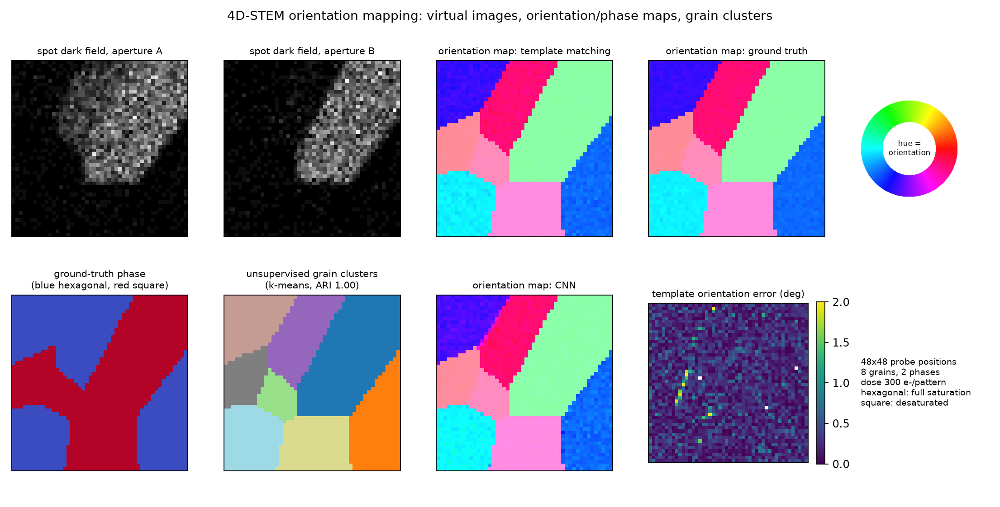

# 4d-stem-orientation-mapping

Orientation and phase mapping from simulated 4D-STEM data: a kinematical
polycrystal simulator with exact per-position ground truth, virtual
imaging, template matching with sub-step refinement, a symmetry-aware CNN,
unsupervised grain clustering, and a config-driven benchmark harness that
measures which method to trust, at what dose, and at what per-pattern cost.
Everything runs on CPU; every committed number regenerates from a
fixed-seed YAML config.



## Headline results

[RESULTS.md](RESULTS.md) carries the full tables and the reading of each
one; the raw numbers live in `results/*.json`. The benchmark scene is a
48x48 scan over 8 Voronoi
grains in 2 phases at 300 electrons per pattern, scored on grain-interior
pixels against exact local ground truth, mean of 3 seeded scans.

**1. Fair-tuned template matching beats the CNN everywhere on in-model
data.** This repository set out to check the popular claim that a CNN
outperforms classical template matching, and the measured answer is no,
not once the classical method is tuned and the data comes from the same
forward model as the library:

| Dose (e-/pattern) | Template MAE (deg) | CNN MAE (deg) | Template phase acc | CNN phase acc |
|---|---|---|---|---|
| 10 | **1.86** | 3.25 | **0.960** | 0.933 |
| 100 | **0.44** | 0.71 | 1.000 | 1.000 |
| 300 | **0.25** | 0.51 | 1.000 | 1.000 |
| 3000 | **0.07** | 0.42 | 1.000 | 1.000 |

Template matching is close to a matched filter here, improves all the way
to the photon limit, and is even faster per pattern (0.12 vs 0.23 ms) at
these library sizes. The CNN saturates at a 0.4-0.5 degree regression
floor and loses hardest exactly where deep learning is usually advertised,
at starved dose.

**2. The one condition where the gap nearly closes is forward-model
mismatch.** When the scans carry a different beam/background budget than
the library assumes (the miscalibrated-instrument scenario,
`configs/mismatch.yaml`), the template advantage shrinks from 2.4x to
1.15x (0.99 vs 1.14 deg), a near-tie rather than a reversal. Both readings
are reported instead of headlining a manufactured CNN win.

**3. Refinement, not library density, is the load-bearing classical
component.** A 30-template library with three-point parabolic refinement
(0.27 deg) already beats the CNN; 600 templates without refinement is
worse than 30 with it. Per-pattern cost is flat from 30 to 600 templates
because matching is one matrix multiply.

**4. Grains fall out of the data without any labels.** k-means on PCA
pattern features recovers the grain map at ARI 0.87 +/- 0.12 (NMI 0.91);
silhouette selection picks k = 6.7 instead of the true 8 because grains
that land within a few degrees of each other are physically
indistinguishable, and merging them actually scores slightly higher (ARI
0.89). On the committed sample the recovery is near perfect (ARI 0.99).

Also measured: 16x16-pixel patterns still support sub-degree template
mapping (0.65 deg) and 0.99 phase accuracy, boundary pixels degrade
all-pixel error exactly in proportion to their fraction, and both methods
track intra-grain mosaic spread up to 5 degrees without averaging it away
(RESULTS.md has the tables).

## What is in the box

**Simulator** (`orient4d.sim`): 2D projected crystals with structure
factors from a per-atom scattering factor (the graphene-like honeycomb
gets its weak first ring and strong second ring from the two-atom basis,
not from hand-tuning), Gaussian Bragg spots pixel-integrated exactly (erf),
direct beam, two-term background, Poisson counting set by one dose
parameter, Voronoi grain scenes with per-scan camera-length jitter,
per-position descan jitter and mosaic spread, and incoherent probe-footprint
mixing at grain boundaries. Ground truth per probe position: grain id,
phase, local orientation, purity. The two phases have nearly coincident
first-ring radii on purpose, so phase identification must use spot
geometry rather than a camera-length cue.

**Methods**: virtual bright/annular/spot dark-field imaging
(`orient4d.virtual`); template matching by normalised cross-correlation on
sqrt intensities with parabolic sub-step refinement (`orient4d.template`);
a 157k-parameter two-head CNN with a symmetry-multiplied circular angle
target (`orient4d.net`, trained with full domain randomisation, see
[models/MODEL_CARD.md](models/MODEL_CARD.md)); PCA + k-means grain
clustering with silhouette k selection (`orient4d.cluster`).

**Scoring** (`orient4d.metrics`): symmetry-aware angular error (modulo
each phase's fold), phase accuracy, and ARI/NMI for grain recovery, with
interior/boundary masks from the purity ground truth.

**Benchmark harness** (`orient4d.benchmark`): four modes (compare, sweep,
template_tuning, clustering) driven by the eight YAML configs in
`configs/`, which regenerate every figure and table in this repository,
including the forward-model-mismatch scenario via a `library_detector`
override.

## Install

Python 3.11. CPU-only PyTorch is sufficient.

```
python -m venv .venv
.venv\Scripts\activate          # Windows; source .venv/bin/activate elsewhere
pip install torch --index-url https://download.pytorch.org/whl/cpu
pip install -e ".[dev]"
```

## Quickstart

```
orient4d demo                                          # all methods on the committed sample
orient4d simulate --scan 48 --grains 8 --dose 300 --seed 1 --out scan.npz --figure scene.png
orient4d map scan.npz --method template --figure map.png
orient4d map scan.npz --method cnn --model models/orientnet.pt --figure map_cnn.png
orient4d virtual scan.npz --figure virtual.png
orient4d cluster scan.npz --k auto --figure clusters.png
orient4d benchmark configs/dose_sweep.yaml             # any committed benchmark
orient4d train --steps 6000                            # retrain the CNN, ~16 min CPU
python scripts/run_all.py --skip-train                 # re-run every benchmark + figures
```

The tutorial notebook (`notebooks/tutorial.ipynb`, committed executed)
walks from the raw 4D data through virtual imaging, template matching, CNN
mapping and clustering to the final scores, with a figure at every step.
The Python API is documented with runnable examples in
[docs/api.md](docs/api.md).

## Bring your own data

No experimental dataset is committed: openly licensed raw 4D-STEM scans
are rare and often licence-ambiguous, so rather than ship something
questionable, `orient4d.io.load_external` accepts any
`(scan_rows, scan_cols, det_y, det_x)` array as `.npy`/`.npz`, and
[data/README.md](data/README.md) documents conversion from vendor formats
via HyperSpy or py4DSTEM plus the caveats (build your own phase library;
retrain the CNN on your forward model; the committed model does not
transfer to experimental data).

## Repository layout

```
src/orient4d/       sim, virtual, template, net, train, cluster, metrics, benchmark, plots, io, cli
configs/            eight YAML benchmark configs, fixed seeds
models/             committed CNN weights (634 KB) + model card
data/sample/        one committed synthetic 32x32 scan with exact ground truth (310 KB)
notebooks/          executed tutorial notebook
docs/               API documentation
figures/, results/  regenerable outputs of the committed configs
scripts/            run_all, make_figures, make_metrics, build_notebook
tests/              47 pytest tests
```

## Scope and limitations

- The forward model is kinematical: single scattering, one zone axis per
  phase, no dynamical effects, no thickness or channelling contrast, no
  detector MTF, a lumped single-Gaussian scattering-factor envelope, and a
  flat Ewald sphere (patterns are 2D reciprocal-space sections). Absolute
  numbers will not transfer to any real instrument; the benchmark measures
  method behaviour within this model.
- The per-pattern intensity budget is fixed, so integrated virtual BF/ADF
  images are featureless by construction; grain contrast in virtual
  imaging appears only through spot dark fields. Real BF/ADF contrast
  mechanisms are out of scope.
- Orientation is a single in-plane angle (one rotation axis). Full 3D
  orientation (Euler angles, out-of-zone tilt) is out of scope, and the
  template-vs-CNN cost conclusion is explicitly scoped to this small
  library regime; a 3D library changes the scaling argument.
- Grain-boundary pixels carry a dominant-grain label with a purity value;
  metrics report interior and all-pixel numbers separately rather than
  pretending boundaries have a single true orientation.
- The committed CNN is specific to the two shipped phases and this
  simulator (see the model card).

## Author

Aamir Malik

- GitHub: https://github.com/aamirmalik-dr
- LinkedIn: https://linkedin.com/in/dr-aamirmalik

## License

MIT for all code and all committed synthetic data. See [LICENSE](LICENSE).
